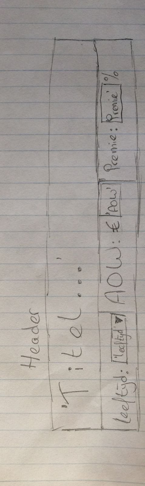

# design
## data
- werkloosheid = een dict met daarin iedere afzonderlijke leeftijd van 0 tot 100 als key en het percentage werkloosheid als value
  - werkloosheid[enkeleLeeftijd] = werkloosheidPercentage
- leeftijdsVerdeling = een nested dict met daarin voor ieder jaartal weer een dict
  - leeftijdsVerdeling[jaartal] = dict met daarin per leeftijd
    - leeftijdsVerdeling[jaartal][totaal] = totale bevolking van dat jaartal
    - leeftijdsVerdeling[jaartal][leeftijd] = aantal personen in die leeftijd

## variabelen
### globaal
- statusQuoLeeftijd = de huidige AOW leeftijd
- statusQuoAOW = het huidige AOW bedrag
- statusQuoPremie = de huidige premie
- modelVariabelenStatusQuo = [*statusQuoLeeftijd*, *statusQuoAOW*, *statusQuoPremie*]

### lokaal
- modelVariabelen = [*leeftijd*, *AOW*, *premie*]
- leeftijd = verandert bij invoer van gebruiker
- AOW = verandert bij invoer van gebruiker
- premie = verandert bij invoer van gebruiker
- currentJaar = verandert bij klik in scherm 1

## functies
### hoofdfuncties
- drawGraph() -> wordt aangeroepen bij wijziging van *leeftijd*, *AOW* of *premie*, tekent de **Balans**
- drawPyramid() = wordt aangeroepen bij wijziging van *currentJaar*, tekent de **Piramide**
- drawChart() = wordt aangeroepen bij wijziging van *currentJaar*, tekent de **Contributie**

### helperfuncties
- calcRevenue(leeftijd, AOW, premie, jaar)
- calcExpense(leeftijd, AOW, premie, jaar)

#### drawGraph
drawGraph()  
&ensp;foreach jaar  
&ensp;&ensp;calcRevenue(leeftijd, AOW, premie, jaar)  
&ensp;&ensp;calcExpense(leeftijd, AOW, premie, jaar)  
&ensp;&ensp;draw line  

#### drawChart
drawChart(jaar)  
&ensp;verschilInkomsten = calcRevenue(leeftijd, premie, jaar) - calcRevenue(statusQuoLeeftijd, premie, jaar)  
&ensp;draw bar inkomstenLeeftijd  
&ensp;verschilUitgaven = calcExpense(leeftijd, AOW, jaar) - calcExpense(statusQuoLeeftijdleeftijd, AOW, jaar)  
&ensp;draw bar uitgavenLeeftijd  

&ensp;verschilUitgaven = calcExpense(leeftijd, AOW, jaar) - calcExpense(leeftijd, statusQuoAOW, jaar)  
&ensp;draw bar uitgavenAOW  

&ensp;verschilInkomsten = calcRevenue(leeftijd, Premie, jaar) - calcRevenue(leeftijd, statusQuoPremie, jaar)  
&ensp;draw bar inkomstenPremie  

## schetsen
### overzicht

Deze visualisatie bestaat uit 4 onderdelen die onderling gelinkt zijn. Deze 4 onderdelen worden in 1 scherm opgedeeld in 4 rechthoeken. Verder zijn er 3 sliders die het getal van de eerder genoemde parameters kan veranderen. De vier onderdelen zijn, van linksboven naar rechtsonder, respectievelijk genaamd **Balans**, **Piramide**, **Contributie** en **Informatie**. De 3 sliders worden geplaatst in de **Header**.

Linksboven worden de inkomsten en uitgaven aan AOW in een lijndiagram tegen elkaar weggezet, met op de x-as jaartallen. Wanneer een parameter wordt veranderd, wijzigt ook deze grafiek. Ook kan hier een jaartal worden geselecteerd wat effect zal hebben op de getoonde informatie in de overige 3 onderdelen.

Het onderdeel rechtsboven is een bevolkingspiramide. Deze toont standaard de bevolkingspiramide voor het huidige jaar (2017) maar veranderd wanneer in onderdeel 1 een bepaald jaartal wordt geselecteerd.

Linksonder wordt een staafdiagram getoond met daarin 3 groepen van elk 2 datapunten. Elk van deze groep laat voor zowel de inkomsten als de uitgaven aan AOW, zien wat het verschil is met de parameters die op dit moment gelden. Hier kan nog gekozen worden of dit voor het geselecteerde jaar moet worden laten zien, hetzelfde als bij de bevolkingspiramide, of voor een langere tijdsspanne.

Rechtsonder staan als laatste nog wat gegevens over het geselecteerde jaar.

### Header

In de **Header** kunnen de *modelVariabelen* worden aangepast. Standaard staan deze op *modelVariabelenStatusQuo*. De variabele *leeftijd* wordt ingesteld middels een dropdownmenu. De variabelen *AOW* en *premie* worden ingevuld middels een tekstvlak dat respectievelijk alleen hele getallen accepteert en slecht getallen met een cijfer achter de komma.

### Balans

Wanneer in de **Header** een van de variabelen wordt aangepast, wordt **Balans** opnieuw getekend.

Wanneer met de muis binnen het kader van de x- en y-as wordt bewogen, beweegt een verticale lijn met de muis mee die van jaar tot jaar springt. Rechts van deze streep staan drie gegevens. Helemaal bovenaan staat het jaartal waar de lijn op staat. Onder de uitgaven-lijn zit een blok met daarin het bedrag dat aan AOW wordt betaald. Onder de inkomsten-lijn zit een blok met daarin het bedrag dat aan premie binnenkomt.

Wanneer met de muis geklikt wordt binnen het kader van de x- en y-as, wordt het weergegeven jaartal in **Piramide** aangepast en ook zo, als hier 'jaartal' is geselecteerd en niet 'tijdreeks', in **Contributie**.

### Piramide

De **Piramide** geeft de bevolkingsopbouw weer voor een bepaald jaartal. Dit jaartal zal standaard ingesteld zijn op 2017, maar kan worden veranderd door bij **Balans** op een bepaald jaartal te klikken.

Bovenin, waar op de schets 'jaartal' staat, zal het jaartal komen dat is geselecteerd. Daaronder zal de totale bevolking in dat jaartal in Nederland worden weergegeven. De linkerkant van de piramide bevat de gegevens van de vrouwelijke bevolking, de rechterkant de gegevens van het mannelijke deel.

Staven links krijgen dezelfde kleur als rechts. Wel wordt er verschil gemaakt in kleur tussen AOW-gerechtigden en mensen die geen AOW ontvangen. Dit wordt gedaan aan de hand van de in de **Header** geselecteerde leeftijd.

Wanneer met de muis over het diagram wordt bewogen zal de staaf van een leeftijdsgroep opkleuren. Dit gebeurt zowel links als rechts, onafhankelijk van waar de muis zich bevindt. Links- en rechtsboven deze bevolkingspiramide zal dan komen te staan respectievelijk hoevel vrouwen en mannen van die leeftijd er op dat moment in Nederland wonen.

Wanneer met de muis over een vak van een variable wordt bewogen, het vak is in dit geval het gedeelte tussen de stippellijnen of tussen de stippellijn en het begin/eindpunt, verschijnt bovenin dat vak een blok met daarin de absolute getallen voor de inkomsten en de uitgaven.

### Contributie

Deze visualisatie laat zien waar, wanneer in de **Header** de variabelen worden aangepast, de veranderingen in **Balans** vandaan komen.

**Contributie** geeft voor elke variabele uit de **Header** afzonderlijk weer of de uitgaven en/of de inkomsten door deze verandering stijgen en/of dalen en hoeveel deze stijging/daling is. Dit wordt berekend door, per variabele, de inkomsten/uitgaven van het AOW-stelsel met de huidig opgegeven variabelen, te verminderen met de inkomsten/uitgaven waarbij de betreffende variabele worden vervangen door zijn status quo tegenhanger.

In de schets zijn er nog 6 staven te zien, dit zullen er 4 worden; 2 onder leeftijd, 1 bij AOW en 1 bij premie. Bij een verandering van de premie zal er natuurlijk niets veranderen in de uitgaven, dit omdat de premie enkel betrekking heeft op de inkomsten. Ditzelfde, maar dan precies andersom, geldt voor het AOW-bedrag. Hier zal alleen een staaf komen die de verandering weergeeft in de uitgaven. Leeftijd is de enige variabele die zowel invloed heeft op de inkomsten als ook op de uitgaven, daarom zal deze wel twee staven krijgen in de visualisatie.

De drie verschillende variabelen worden gescheiden door een stippellijn.

Bij het getal 2 en 3 in deze schets kan worden aangevinkt of deze visualisatie de contributie van de variabelen moet tonen voor een enkel jaar of voor meerdere jaren. Wanneer voor een tijdreeks wordt gekozen kan met twee dropdownmenus het begin- en eindjaar worden gekozen. In dit geval zal de berekening hetzelfde zijn als hiervoor beschreven voor een enkel jaar, met als enige verschil dat de totalen van ieder afzonderlijk jaar bij elkaar worden opgeteld.

Waar in de schets het getal 1 staat, zal het jaartal komen te staan dat in **Balans** is geselecteerd. Echter, wanneer bij de getallen 2 en 3 tijdreeks is aangevinkt in plaats van jaartal, zal het tijdinterval worden getoond.

### Informatie
In het blok informatie zal enkele informatie over de dataset worden weergegeven. De exacte weer te geven informatie wordt op een later moment over beslist en is ook afhankelijk van de weergegeven informatie in de drie visualisaties.
