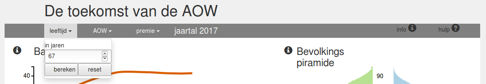
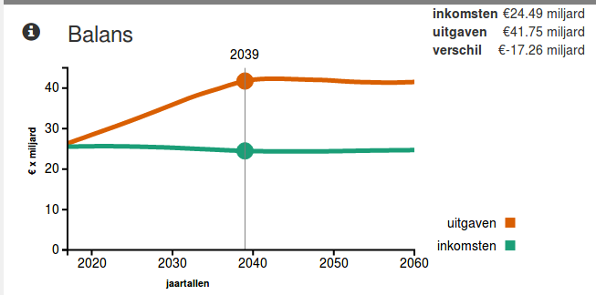
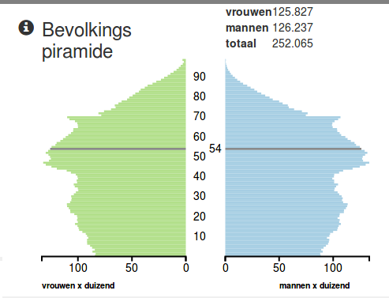
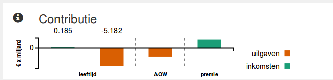

De visualisatie over de toekomst van de AOW laat de gebruiker op de stoel van de beleidsmaker zitten. Door de variabelen te kunnen veranderen die de inkomsten en uitgaven voor de Nederlandse overheid uit het AOW-stelsel bepalen, krijgt de gebruiker meer inzicht in de onhoudbare situatie van de AOW.

##Visualisatie

Deze pagina bestaat uit drie grafieken en twee control elementen. Twee van deze grafieken, de balans en de contributie, geven de gevolgen voor de staatskas weer van een verandering in de variabelen. De derde grafiek, de bevolkingspiramide, geeft inzicht in de herkomst van de onhoudbare situatie rondom het AOW, namelijk de vergrijzing.

Het eerste control element zijn de variabelen in de menubalk. Door deze te veranderen, veranderen ook de grafieken balans en contributie en zijn direct de gevolgen zichtbaar van deze beleidswijziging. Het tweede control element, de slider rechtsonder, laat de gebruiker automatisch door de jaren heenlopen. Iedere keer worden zowel de contributie als de bevolkingspiramide aangepast. Deze functionaliteit laat met name de vergrijzing door de jaren heen zien.

##Header

In de *header* kunnen de variabelen worden aangepast en wordt het jaartal getoond van twee van de drie grafieken. Wanneer op een van de drie variabelen wordt geklikt, verschijnt een dropdownmenu waarin de meeteenheid wordt weergegeven en een tekstvlak om een nieuwe waarde in te voeren. Wanneer een nieuwe waarde wordt ingevoerd, zullen ook de grafieken opnieuw worden getekend.

##Balans

Zodra een van de variabelen wordt gewijzigd, wordt ook deze grafiek aangepast.

Wanneer met de muis binnen het kader van de x- en y-as wordt bewogen, beweegt een verticale lijn met de muis mee die van jaar tot jaar springt. Boven deze streep staat het jaartal waar de muis zich bevindt. In de rechterbovenhoek verschijnen de gegevens die bij dit jaartal horen.

Wanneer met de muis geklikt wordt binnen het kader van de x- en y-as, wordt het weergegeven jaartal in aangepast en worden de bijbehorende grafieken opnieuw getekend.

##Piramide

De *piramide* geeft de geschatte bevolkingsopbouw voor een bepaald jaar van Nederland weer. Het weergegeven jaartal is te zien in de menubalk. Wanneer het jaartal verandert, wijzigt deze grafiek ook automatisch.

Wanneer de muis over de *piramide* beweegt zal de staaf waar de muis zich boven bevindt, veranderen van kleuren. Daarnaast zal rechtsboven in de visualisatie informatie verschijnen over deze leeftijdsgroep.

##Contributie

Deze visualisatie toont de opbouw van veranderingen in *balans* wanneer een variabele is gewijzigd. Het geeft voor elk van de drie variabelen weer of, door het wijzigen van deze variabele, de inkomsten en/of uitgaven stijgen dan wel dalen.

Opnieuw is het jaartal waar deze visualisatie zich op baseert te zien in de menubalk.

Wanneer in de grafiek geklikt wordt zal boven de desbetreffende staaf info verschijnen over hoeveel de inkomensten en/of uitgaven zijn gestegen of gedaald.

##Slider
Met de slider rechtsonder op de pagina kan het jaartal worden gewijzigd waar de *piramide* en *contributie* voor getekend worden. Naast enkel het jaartal te veranderen, kan ook van het huidige jaartal af tot aan 2060 de ontwikkelingen gezien worden. Dit kan met behulp van de afspeelknop, die beide grafieken iedere seconde update. Wanneer vervolgens op de pauzeknop wordt geklikt, blijven het jaartal en de grafieken hangen in het tot dan toe bereikte jaartal.
