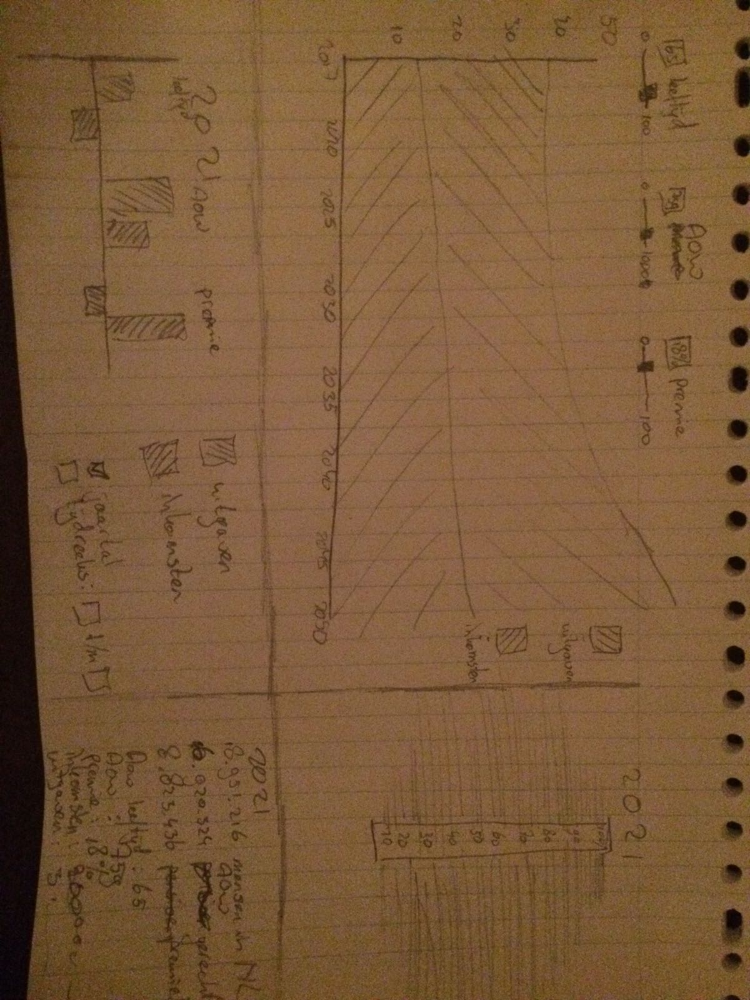

# ProgProject

Deze visualisatie maakt het mogelijk voor de gebruiker een ideale verdeling te vinden voor 3 verschillende parameters met betrekking tot het Nederlandse AOW-stelsel. De 3 parameters zijn de AOW-leeftijd, de premie en het bedrag dat wordt uitgekeerd bij het bereiken van de AOW-leeftijd.

Door een makkelijk en speelse visualisatie te maken van mogelijke combinaties van deze parameters, wordt het probleem rondom de AOW (het tekort aan AOW om iedereen te betalen) zichtbaar en wordt de kans geboden met andere mogelijke oplossingen te komen voor dit probleem.

## de visualisatie

Deze visualisatie bestaat uit 4 onderdelen die onderling gelinkt zijn. Deze 4 onderdelen worden in 1 scherm opgedeeld in 4 rechthoeken. Verder zijn er 3 sliders die het getal van de eerder genoemde parameters kan veranderen.

Linksboven worden de inkomsten en uitgaven aan AOW in een lijndiagram tegen elkaar weggezet, met op de x-as jaartallen. Wanneer een parameter wordt veranderd, wijzigt ook deze grafiek.

Het onderdeel rechtsboven is een bevolkingspiramide. Deze toont standaard de bevolkingspiramide voor het huidige jaar (2017) maar veranderd wanneer in onderdeel 1 een bepaald jaartal wordt geselecteerd.

Linksonder wordt een staafdiagram getoond met daarin 3 groepen van elk 2 datapunten. Elk van deze groep laat voor zowel de inkomsten als de uitgaven aan AOW, zien wat het verschil is met de parameters die op dit moment gelden. Hier kan nog gekozen worden of dit voor het geselecteerde jaar moet worden laten zien, hetzelfde als bij de bevolkingspiramide, of voor een langere tijdsspanne.

Rechtsonder staan als laatste nog wat gegevens over het geselecteerde jaar. Op het startscherm zal hier niets staan.
