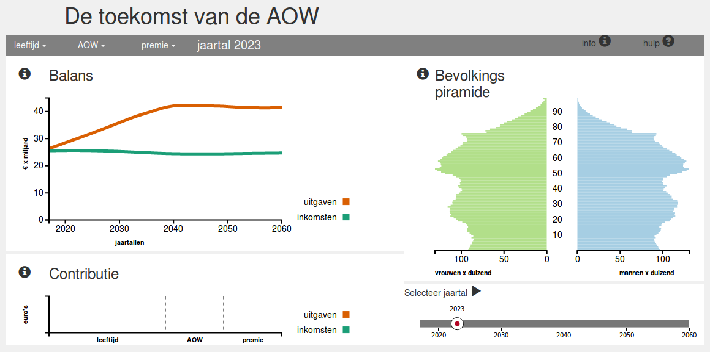

De visualisatie over de toekomst van de AOW laat de gebruiker op de stoel van de beleidsmaker zitten. Door de variabelen die de inkomsten en uitgaven voor de Nederlandse overheid uit het AOW-stelsel bepalen, te kunnen veranderen, krijgt de gebruiker meer inzicht in de onhoudbare situatie omtrent de AOW.

#Visualisatie

Deze pagina bestaat uit drie grafieken en twee control elementen. Twee van deze grafieken, de *balans* en de *contributie*, geven de gevolgen voor de staatskas van een verandering in de variabelen. De derde grafiek, de *bevolkingspiramide*, geeft inzicht in de herkomst van de onhoudbare situatie rondom de AOW, namelijk de vergrijzing.

Het eerste control element zijn de variabelen in de menubalk. Door deze te veranderen, veranderen ook de grafieken *balans* en *contributie* en zijn direct de gevolgen zichtbaar van deze beleidswijziging. Het tweede control element, de slider rechtsonder, laat de gebruiker automatisch door de jaren heen lopen. Iedere keer worden zowel de *contributie* als de *bevolkingspiramide* aangepast. Deze functionaliteit laat met name de vergrijzing door de jaren heen zien.

#Design
De code achter deze pagina is grofweg ingedeeld in drie groepen. In de hoofdmap zit allereerst het bestand **index.html** welke alle basiselementen op de pagina plaatst. Daarnaast is er de map **css** met daarin drie stylingdocumenten. Hierin zitten de stylingdocumenten die horen bij bootstrap en de d3 slider. Het derde document, **stylesheet.css** bevat de basisstyling van de pagina. In de **javascript** map zitten alle scripts van de gebruikte libraries. Verder bevat deze map de vier hoofddocumenten die de visualisaties en interacties mogelijk maken, namelijk **main.js**, **graphs.js**, **helpers.js** en **components.js**.

##main.js
In dit bestand worden allereerst alle globale variabelen verklaard. Vervolgens worden vanuit de DOM alle elementen geselecteerd voor de grafieken en worden deze op de juiste positie op de site geplaatst. Door deze elementen op te slaan onder een variabele kunnen ze gemakkelijk worden opgeroepen in andere bestanden. Na de initialisatie van de globale variabelen worden er nog enkele elementen uit de DOM geselecteerd om hen variabele attributen mee te geven. Op deze manier kunnen deze elementen met het wijzigen van één variabele veranderen in plaats van het wijzigen van dezelfde variabele in verschillende bestanden.

Als al deze onveranderlijke elementen zijn geplaatst en verklaard worden de drie datasets ingeladen. Tot deze bestanden zijn ingeladen of er een error optreedt, wordt er een laadscherm getoond om zo niet een onvolledige pagina te tonen. Wanneer de bestanden, om wat voor reden dan ook, niet kunnen worden ingeladen, wordt een foutmelding weergegeven.

Zodra het laden van de datasets is voltooid, worden nog enkele globale variabelen verklaard die gebruik maken van deze data. Vervolgens worden de controlelementen geïnitialiseerd en hun functionaliteit toegepast. Als laatste worden de drie grafieken gemaakt met de variabelen uit het basisjaar.

##graphs.js
Het bestand **graphs.js** bestaat uit drie functies, voor iedere grafiek één. Deze hebben min of meer dezelfde indeling. Iedere functie begint met het verwijderen van de eerder gemaakte grafiek, met uitzondering van de titel en de legenda. Dit gedeelte zal de eerste keer dat de functie wordt aangeroepen, nog niets verwijderen. Als echter later, door interactie, de grafiek opnieuw moet worden getekend, is deze regel nodig om de grafieken niet over elkaar heen te laten vallen.
Het volgende onderdeel van de functies is het omzetten van de data in variabelen die gebruikt kunnen worden voor het tekenen van de grafieken. Vervolgens worden variabelen geïnitialiseerd met functies voor het schalen van de grafiek en, indien nodig, voor het tekenen van de data. Als laatste worden de elementen op het scherm geplaatst, de grafiek getekend en onderaan de functie wordt een nieuwe functie aangeroepen voor het tekenen van de assen.

Bij het plaatsen van de elementen wordt steeds begonnen met het plaatsen van de infoknoppen in de visualisatie. Vervolgens wordt de grafiek zelf getekend, met mogelijke verwijzingen naar functies voor de interactie. Mocht er, voor de interactie, een focuselement nodig zijn dat over de grafiek heen wordt geplaatst, dan wordt deze na het tekenen van de grafiek zelf, geplaatst.

##helpers.js
Dit bestand bevat twee functies voor het berekenen van de inkomsten en uitgaven, een functie voor het opmaken van getallen en zeven functies die interactie toevoegen aan de grafieken.

##components.js
Dit bestand is bedoeld om zowel **main.js** als **graphs.js** overzichtelijk te houden. Het bevat voor iedere grafiek, indien nodig, een functie voor het plaatsen van de titel, de legenda en de assen. Door deze functies niet volledig uit te schrijven in de eerder genoemde bestanden, is het makkelijker door deze bestanden te zoeken naar de belangrijkere punten zoals het tekenen van de grafiek. Daarnaast is het vinden van de titel, legenda of assen op deze manier een stuk gemakkelijker.

Iedere titelfunctie bestaat uit een enkele lijn code, verdeeld over meerdere regels. Hierin wordt een html header, met daarin de titel, toegevoegd aan de SVG. De legenda’s bestaan uit 5 regels code, opnieuw verdeeld over meerdere lijnen. Eerst wordt er aan de visualisatie een element toegevoegd waar de legenda in zal komen. Vervolgens worden hierin apart twee gekleurd vierkanten met de bijbehorende tekst geplaatst.

Ook de functies voor de assen hebben een zelfde opbouw, al kan de uitvoering wat verschillen door de complexiteit van het plaatsen van de assen. Allereerst worden de variabele functies aangemaakt waarmee de d3 functies voor assen kunnen worden aangeroepen. Vervolgens worden de plaatsen van de assen ingesteld om hier vervolgens de assen op aan te roepen. Als laatste worden de labels aan de assen toegevoegd.

##Indeling
Voor de indeling van de pagina is gebruik gemaakt van bootstrap. Omdat de visualisaties gemaakt zijn voor op volledig scherm, is gebruik gemaakt van de medium columns van bootstrap. Het nadeel heirvan is dat, wanneer de pagina bekeken wordt op bijvoorbeeld een mobiel apparaat, de indeling niet stand houdt en alle visualisaties onder elkaar worden geplaatst.

##Kleuren
In de visualisaties worden vier kleuren onderscheiden; de inkomsten, de uitgaven en mannen en vrouwen. Om de visualisaties ook bruikbaar te laten zijn voor mensen met kleurenblindheid, is er voor gekozen in iedere visualisatie twee kleuren te nemen die, volgens colorbrewer2.org althans, gemakkelijk te onderscheiden. Het nadeel hiervaan is dat de kleuren een minder grote interpratiefactor hebben.

De kleuren worden toegevoegd door het gebruiken van classes. Het voordeel hiervan is dat, mochten de kleuren aangepast moeten worden, dit alleen maar hoeft te gebeuren in **stylesheet.css** in plaats van in ieder bestand apart.

#Process
Tijdens het proces zijn een aantal grote dingen veranderd zoals de informatieteksten en het tonen van de variabelen in de menubalk. Verder hebben er kleine, minder zichtbare veranderingen plaats gevonden; aanpassingen die met name van toepassing zijn op de code. Hieronder zullen de belangrijkste veranderingen verder worden uitgelicht.

##Informatie
Allereerst is het informatieblok, rechtsonder op de pagina, vervangen voor de slider. Te veel tekst op de pagina maakt deze erg rommelig, daarnaast was er geen andere gepaste plaats voor de slider. De teksten die in het informatieblok zouden verschijnen zijn grotendeels verwerkt als interactie in de grafieken zelf. Ook kan een beschrijving, evenals de bronnen, van de gebruikte data alsnog gevonden worden onder de algemene informatieknop.

In de grafiek over de *contributie* wordt geen informatie meer weergegeven aan de zijkant, maar boven de staven zelf, om zo de connectie duidelijker te maken. Daarnaast wordt deze informatie niet gegeven wanneer de muis eroverheen beweegt, maar pas wanneer in de grafiek wordt geklikt. Zo blijft de informatie staan wanneer de muis zich verplaatst naar een andere grafiek en kan de getoonde informatie makkelijk gebruikt worden voor vergelijking.

Verder wordt niet langer meer het jaartal getoond boven de *bevolkingspiramide* en de *contributie*. Dit was dubbelop en is vervangen voor het jaartal in de menubalk. Een voordeel is dat de grafieken hierdoor minder rommelig ogen, een nadeel is dat de connectie tussen het jaartal en de visualisaties minder sterk is.

##Variabelen
De variabelen worden niet langer meer veranderd door een slider maar door een tekstvlak dat enkel getallen accepteert. Hierdoor is het makkelijker een exact getal in te voeren.

De grootste verandering is echter de manier waarop de variabelen worden getoond. In een eerdere versie was de huidige waarde van de variabelen altjd zichtbaar en kon deze met één enkele klik veranderd worden. Dit maakte de pagina erg chaotisch. Daarom is gekozen iedere variabele een eigen dropdown-menu te geven. Nadeel hiervan is dus dat, zonder de variabele aan te klikken, op de pagina niet zichtbaar is wat de huidige waarden van de variabelen zijn. Voordeel daarentegen is dat er makkelijk extra informatie gegeven kan worden over bijvoorbeeld de meeteenheid.

##Berekening
In eerste instantie was er geen dataset over verschillende inkomensklassen. De berekening van betaalde premies werd gedaan aan de hand van een Nederlands gemiddeld inkomen. Dit inkomen was echter zo hoog dat het bedrag altijd uitkwam op de maximaal te betalen premie. Door het toevoegen van inkomensklasse kan een accuratere schatting worden gemaakt van inkomens en dus de te betalen premies.

Een andere belangrijke verandering is te zien bij *contributie*. In eerste instantie zou voor iedere variabele zowel de verandering in inkomsten als de verandering in uitgaven getoond worden. Echter, enkel de variabele leeftijd heeft op beiden invloed. De variabele AOW heeft slechts invloed op de uitgaven en premie op de inkomsten. De twee overbodige staven zijn dan ook uit de grafiek verwijderd.

##Variabelnamen
Om de code beter leesbaar te maken, maar bovenal om interactiever om te kunnen gaan met variabelen in de code, is gekozen om deze zoveel mogelijk op te slaan in dictionaries in plaats van het gebruik van lange variabelnamen.

Deze aanpassing heeft met name de afhandeling van de slider en de variabelen in de menubalk een stuk gemakkelijker gemaakt. Doordat de variabelen in de dictionaries een gemeenschappelijke opbouw hebben, kunnen ze in functies gemakkelijker worden gemanipuleerd waardoor nog maar 1 regel code nodig is in plaats van voor iedere variabele weer een aparte regel.
